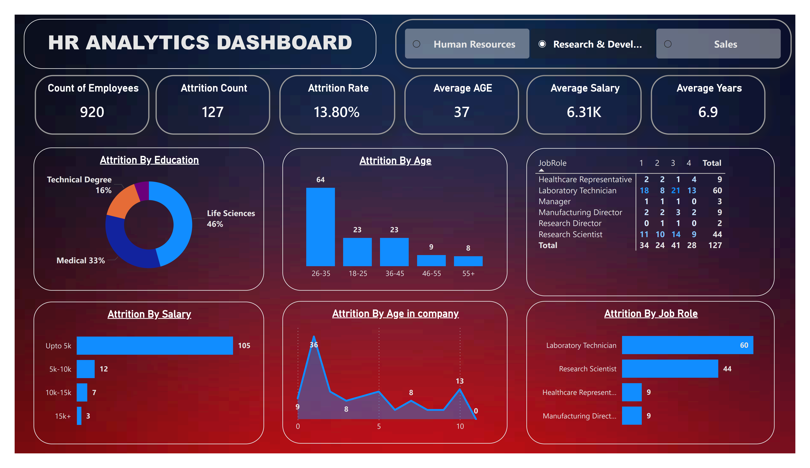

# HR Analytics Dashboard

## Overview
The HR Analytics Dashboard is an interactive Power BI project designed to analyze employee attrition, workforce demographics, salary trends, and job role distribution within an organization.

This dashboard helps HR professionals and management teams identify key factors affecting employee retention and make data-driven decisions.

---

# Dashboard Preview

---

# Key KPIs

| KPI | Value |
|---|---|
| Total Employees | 920 |
| Attrition Count | 127 |
| Attrition Rate | 13.80% |
| Average Age | 37 |
| Average Salary | 6.31K |
| Average Years at Company | 6.9 |

---

# Features

- Employee Attrition Analysis
- Department-wise Filtering
- Education-wise Attrition Breakdown
- Salary-wise Attrition Analysis
- Job Role Attrition Insights
- Age Group Analysis
- Employee Tenure Analysis
- Interactive Visualizations

---

# Dashboard Insights

## Attrition by Education
- Life Sciences employees show the highest attrition.
- Medical and Technical Degree backgrounds also contribute significantly.

## Attrition by Age
- Employees aged 26–35 have the highest attrition rate.
- Senior age groups show lower attrition.

## Attrition by Salary
- Most employee attrition occurs in lower salary ranges.
- Employees with higher salaries tend to stay longer.

## Attrition by Job Role
- Laboratory Technicians and Research Scientists show the highest attrition.

## Attrition by Years at Company
- Employees with fewer years at the company are more likely to leave.

---

# Tools & Technologies Used

- Power BI
- Power Query
- DAX
- Microsoft Excel

---

# Files Included

| File Name | Description |
|---|---|
| `HR_Analytics_Dashboard.pbix` | Power BI Dashboard File |
| `HR_Analytics_Dataset.xlsx` | Dataset Used for Analysis |
| `dashboard-screenshot.png` | Dashboard Screenshot |
| `README.md` | Project Documentation |

---

# How to Use

1. Download the repository.
2. Open the `.pbix` file in Power BI Desktop.
3. Refresh the dataset if required.
4. Explore the dashboard using filters and visuals.

---

# Business Objective

The purpose of this project is to:

- Analyze employee attrition trends
- Identify high-risk departments and job roles
- Improve employee retention strategies
- Support HR decision-making through data analytics

---

# Future Improvements

- Predictive Attrition Analysis
- Real-Time Data Integration
- Employee Performance Analytics
- Advanced HR KPIs
- Drill-through Reports

---

# Author

## Sumit Kumar

Aspiring Data Analyst | Power BI Enthusiast

GitHub: https://github.com/Sk986871

LinkedIn: www.linkedin.com/in/sumit-kumar-112145292

---